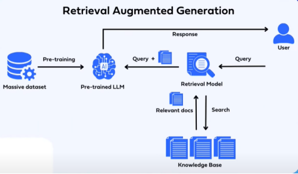
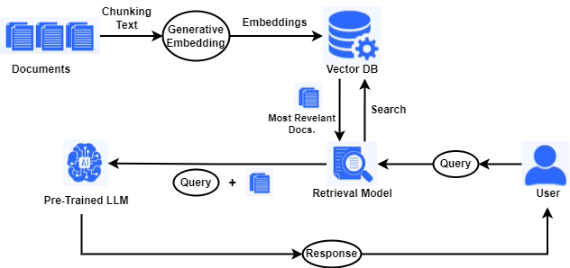

# RAG (Retrieval-Augmented Generation)

- RAG, bir dil modelinin cevaplarını oluştururken bilgi getirme sürecini içeren bir yöntemdir. Bu, modelin cevapları oluştururken belirli bir konu veya bağlamla ilgili bilgileri getirmesi anlamına gelir.

- RAG, cevap üretmeden önce dış veri (örneğin PDF içerikleri) ile bağlam oluşturur. Böylece doğru ve güncel cevaplar üretilebilir.

- Modelin bir veri tabanına erişmesini sağlayarak cevapların kalitesini arttırır. Bu veri tabanı özel ve güvenilir verilerden oluşur. Model, veri tabanındaki bilgilerle kendi bilgilerini birleştirir ve daha mantıklı cevaplar üretir. Böylece modelin halüsinasyon görmesi engellenir. 

### RAG TABANLI BİR CHATBPTUN ÇALIŞMA PRENSİBİ

1) Chatbotun cevap üretebilmesi için kullanacağı PDF dosyalarındaki metinler parçalanır bu işleme “chunking” işlemi denir. 

2) Daha sonrasında parçalanmış metinlere “embedding” işlemi uygulanarak elde edilen veriler veri tabanına gömülür.

3) Arayüzde kullanıcıdan alınan sorgu veri tabanında bulunan verilerle karşılaştırılarak sorgu ile en ilişkili dosyalar seçilir.

4) Seçilen dosyalar ve sorgu birleştirilerek bir prompt oluşturulur ve bu prompt daha önceden eğitilmiş olan hazır LLM’e gönderilir.

5) LLM’den elde edilen cevap kullanıcıya aktarılmak üzere chatbotun arayüzünde 
gösterilir.

### RAG Tabalı Örnek LLM : DialoGPT

- OpenAI tarafından geliştirilen RAG tabanlı bir LLM. 

- GPT2 tabanlı, tek turlu diyaloglar için eğitilmiş bir dil modelidir. Kullanıcı girdisi tokenize edilir, modele verilir ve cevap üretilir.

- ohttps://blog.startupstash.com/how-to-create-your-own-ai-chatbot-using-dialogpt-22cff1e0f315 ile sadece DialoGPT için olan kısımlarla kod denemesi yaptım ama iyi bir şekilde soruları cevaplamıyor.

- oDialoGPT'den üretilen yanıtın, tek turlu bir konuşma Turing testi altında insan yanıt kalitesiyle karşılaştırılabilir olduğunu göstermektedir.

- DIALOGPT : Large-Scale Generative Pre-training for Conversational Response Generation (makale)