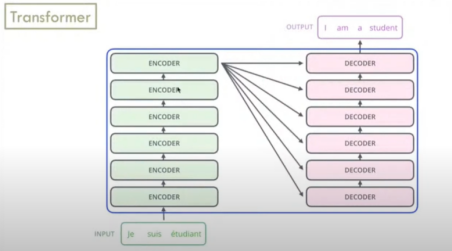
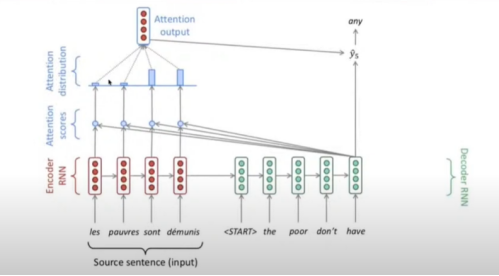
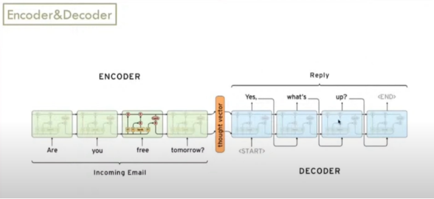

# Generative Ai

**Generative AI** => Derin öğrenmenin bir alt alanıdır. Metin, resim, ses, video gibi yeni içerikler üretmek için kullanılır.

**Dil Modeli:** Sözcük dizileri üzerindeki bir olasılık dağılımıdır.

## 📌 Large Language Model (LLM) Nedir?

LLM (Büyük Dil Modeli), **insan dilini anlama ve üretme** yeteneğine sahip, **çok büyük miktarda veriyle** eğitilmiş **derin öğrenme** tabanlı bir yapay zeka modelidir. Genellikle **metin oluşturma, soru-cevap, çeviri, duygu analizi** gibi birçok **doğal dil işleme (NLP) görevini** yerine getirebilir.

---

## 🧠 LLM Temel Yapısı

LLM'ler genellikle aşağıdaki katmanlardan oluşur:

* **Embedding Layer:** Kelimeleri sayısal vektörlere dönüştürür.
* **Feedforward Layer (FFN):** Temsil edilen kelimeleri işleyerek anlam çıkarır.
* **Attention Mechanism:** Cümledeki önemli kelimelere odaklanmayı sağlar.
* **Transformer Mimarisi:** Encoder ve Decoder yapıları ile anlamlı içerik üretimini mümkün kılar.

### 🔄 Encoder-Decoder Yapısı

* **Encoder:** Girdiyi (prompt) analiz eder, anlamlandırır.
* **Decoder:** Girdiye dayalı yeni içerik üretir (metin, cevap vb.).

---

## 🧰 Önemli Teknolojiler ve Kavramlar

### 🟢 Embedding Teknikleri

**Embedding:** Bir kelimenin veya metnin bir sayısal vektörle temsil edilmesi işlemidir.


1) **Word2Vec (CBOW, Skip-gram)**

- **CBOW:** Etrafındaki kelimelerden ortadaki kelimeyi bulmaya çalışıyor.
- **SKIPGRAM:** Ortadaki kelimelerden etrafındaki kelimeleri bulmaya çalışıyor.


Sayısal değerler daha hızlı anlayabilmek için renklendirilmiştir.


Kelimeler arasındaki ilişkilerin yakalanması.


Kelimler vektörleri üzerinde lineer cebir yapılabilir.

2) **ELMo(Embedding from Language Model) (2018)** 

- Bağlamsal embedding
- Bağlam içinde kullanılır. Test sırasında “apple” ın elma mı yoksa marka mı olduğunu bağlama göre anlar. Word2vec bunu gerçekleştiremez, her iki “apple” ın vektörü aynıdır.

3) **BERT:** 
- Çift yönlü bağlamlı embedding

### 🟣 Transformer Mimarisi (2017)

- "Attention Is All You Need" makalesiyle tanıtıldı. Modern LLM'lerin temelidir.



LLM’nin en yaygın mimarisidir. Transformer modeli, bir **kodlayıcı** ve bir **kod çözücüden** oluşur. Ayrıca uzun kısa süreli bellek modelleri gibi geleneksel modellerden daha hızlı öğrenmesini sağlayan, **dikkat mekanizması (attention mechanism)** adı verilen bir mekanizmayı içerir. Bu mekanizma, bir kelimenin anlamını anlamak için bir cümlenin diğer kısımlarına odaklanmayı sağlar. Aradaki ilişkileri keşfetmek için eş zamanlı olarak matematiksel denklemler yürütür. 

### 🧲 Attention Mekanizması

- Kime ne kadar dikkat verilecek?

- Kelimenin hangi bağlamda ne kadar önemli olduğunu belirler. Bu sayede daha isabetli anlam çıkarımı yapılır.



- Bir çeviri sistemi var. Daha önce geriye doğru kelimelere dikkat azalırdı. Yani en çok dikkati “demunis” en az dikkati “les” alırdı ama şimdi hangisine ne kadar dikkat vereceğini **attention** ile ölçülür. Bu şekilde en son kelimeye bağlı olma aşılıyor daha önceki kelimeler de dikkate alınır.

### 🧲 Encoder-Decoder Mimarisi 



- Chatbotlar için soru-cevap, çeviriler için tr-en vb. şeklinde eğitilirler.
* **Encoder:** Girdiyi (prompt) analiz eder, anlamlandırır.
* **Decoder:** Girdiye dayalı yeni içerik üretir (metin, cevap vb.).

---

## 🏗️ Popüler LLM Modelleri

| Model  | Geliştirici | Özellik                                              |
| ------ | ----------- | ---------------------------------------------------- |
| BERT   | Google      | Çift yönlü anlayış, dil anlama görevlerinde başarılı |
| GPT-3  | OpenAI      | Soru-cevap, metin üretimi                            |
| T5     | Google      | Çeviri ve metin üretimi                              |
| PaLM 2 | Google      | Çok dilli destek, yüksek doğruluk                    |
| BARD   | Google      | Google arama motoruna entegre, LAMDA tabanlı         |

---

## 🛠️ Model Eğitimi ve İnce Ayar

### 🔹 Pretraining (Ön Eğitim)

Wikipedia, kitaplar, GitHub gibi geniş veri setleri ile eğitilir.

### 🔹 Fine-Tuning (İnce Ayar)

Model, özel bir göreve göre yeniden eğitilir. Örneğin, müşteri yorumlarını sınıflandırmak için daha az ve etiketli veri ile.

### 🔹 Prompt Tuning

Kullanıcıdan alınan komutla modelin yönlendirilmesidir. Örnek:

```
Customer review: This product is great!
Customer sentiment: positive
```

### 🔹 PEFT (Parameter-Efficient Fine-Tuning)

Az parametre ile yüksek performans sağlar. Örn: LoRA (Low-Rank Adaptation)

---

## 📦 Hazır Model Kullanımı

* Hugging Face gibi platformlardan önceden eğitilmiş modeller indirilebilir.
* Transformers kütüphanesi ile kolay entegrasyon yapılabilir.

---

## 🧪 Retrieval Augmented Generation (RAG)

LLM’lerin dış veri tabanlarından bilgi çekerek daha doğru cevaplar üretmesini sağlar.

* Gerçek zamanlı veriler, kullanıcıya özel içerikler, güncel bilgi sağlanabilir.
* Halüsinasyonların önüne geçilmesini sağlar.

---

## ✅ LLM Kullanım Alanları

* Metin üretimi (şiir, makale, kod)
* Çeviri (otomatik veya talimatla)
* Sohbet robotları (chatbot)
* Duygu analizi
* Bilgi alma ve özetleme

---

## ⚠️ LLM’lerin Sınırlamaları

* **Halüsinasyon:** Yanlış ve uydurma bilgi üretimi
* **Önyargı (Bias):** Eğitim verilerinden gelen eşitsizlik
* **Güvenlik:** Kişisel verileri sızdırma riski
* **Rıza:** Verilerin izinli olup olmadığı belirsiz olabilir
* **Ölçeklenebilirlik:** Donanım ve kaynak gereksinimi yüksektir

---

## 📌 Sonuç

LLM’ler; güçlü, esnek ve çok yönlü araçlardır. Ancak dikkatli kullanılmaları, etik kurallara uyulması ve kaliteli veri ile eğitilmeleri gereklidir.

> "Kalite, nicelikten önemlidir."

---

## 🔗 Faydalı Kaynaklar

* [Hugging Face](https://huggingface.co/)
* [Google AI Blog](https://ai.googleblog.com/)
* [OpenAI](https://openai.com/)
