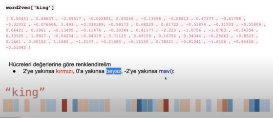
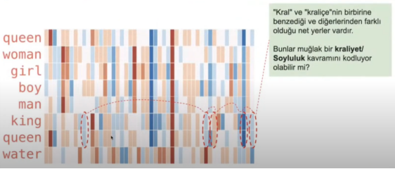
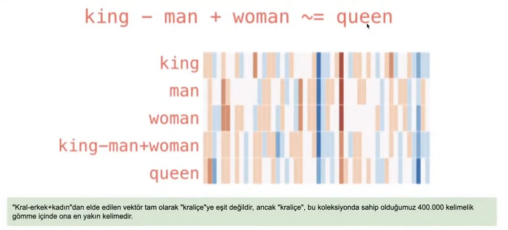

# **Word2Vec**

Word2Vec, kelimeleri anlam benzerliklerine göre sayısal vektörlere dönüştüren bir wprd embedding tekniğidir. **CBOW** ve **Skip-gram**olarak iki mimarisi vardır. Benzer kelimeler vektör uzayında birbirine yakın olur.

- Anlamsal benzerlikleri sayısal olarak ifade eder. Yani *“king - man + woman ≈ queen”* gibi ilişkileri kurabilir.

- **CBOW:** Etrafındaki kelimelerden ortadaki kelimeyi bulmaya çalışıyor.
- **SKIP-GRAM:** Ortadaki kelimelerden etrafındaki kelimeleri bulmaya çalışıyor.

Sayısal değerler daha hızlı anlayabilmek için renklendirilmiştir.

Kelimeler arasındaki ilişkilerin yakalanması.

Kelimler vektörleri üzerinde lineer cebir yapılabilir.